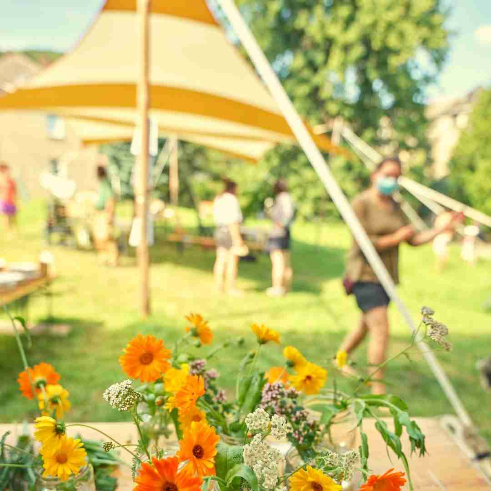
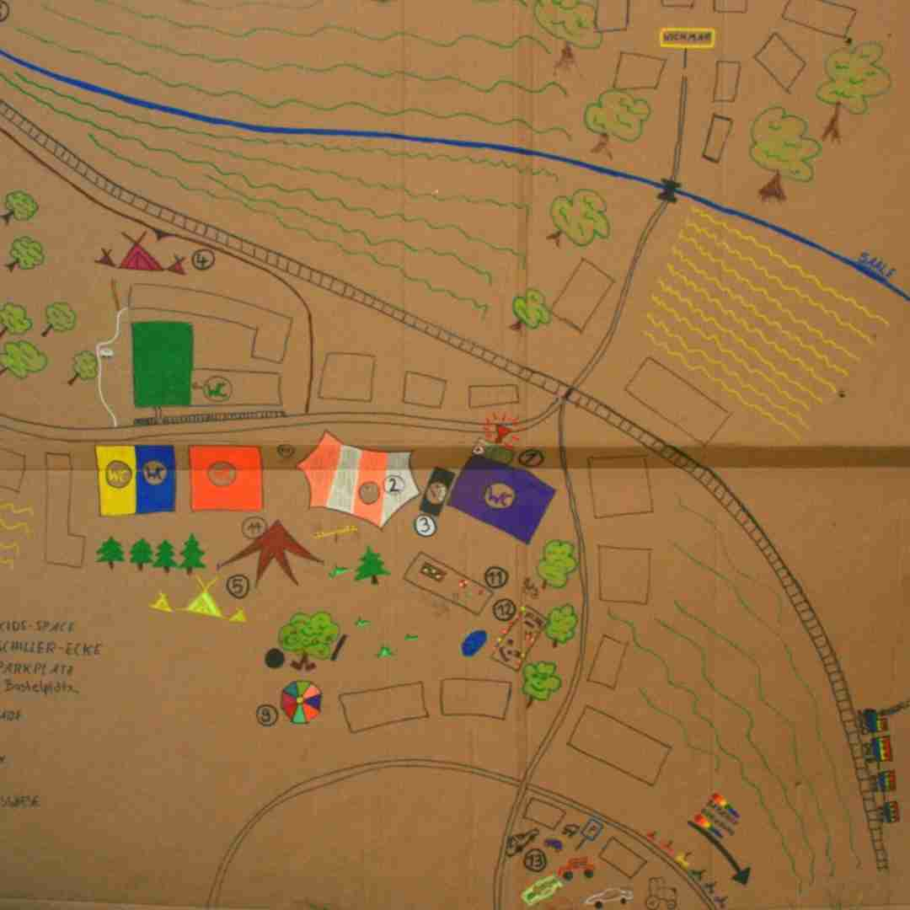

<header class="www">
<h1> Workshopwochenende 2022   19.–21. August </h1>
</header>

 
 
 

Vom 19.-21. August 2022 findet das diesjährige Workshopwochenende in Würchhausen statt. Die Veranstaltung wird vom Wichmarer Wohnprojekt zusammen mit dem Lebendige Dörfer e.V. organisiert und durchgeführt.

<strong> Bist du dabei? </strong>

Hier geht´s zur <a href="https://framaforms.org/anmeldung-zum-workshopwochenende-wichmar-1625664080">  <strong> Anmeldung </strong> </a>

<strong> Wir freuen uns auf euch! </strong>

<figure id="gallery">
 		<figure> 
 			<figcaption> <a href="https://dorf.wichmar.eu/Workshopwochenende.html">  Vision </a> </figcaption>
 		</figure>
 		<figure class="mitte"> 
 			<figcaption> <a href="https://dorf.wichmar.eu/3W22_Programm.html"> Programm </a></figcaption>
 		</figure>
 		<figure class="rechts"> 
 			<figcaption> <a href="https://dorf.wichmar.eu/3W22_Infos.html"> Alle Infos </a> </figcaption>
 		</figure>
</figure>

​
