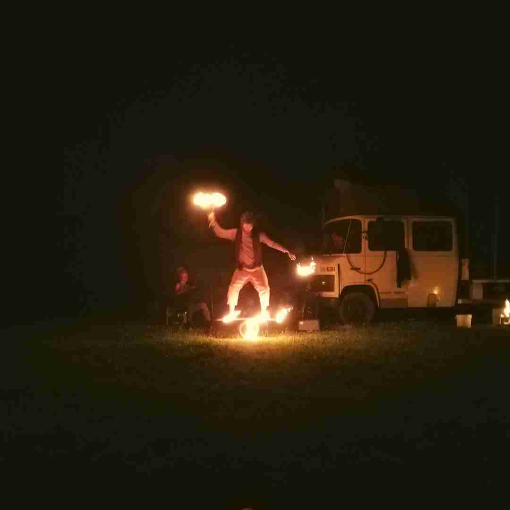

# Workshopwochenende 2022


​
Vom **19.-21. August 2022** findet das diesjährige Workshopwochenende in Würchhausen statt. Die Veranstaltung wird vom Wichmarer Wohnprojekt organisiert und durchgeführt.

 <h4> <a href="https://dorf.wichmar.eu/Akkordeontest"> Alle Infos </a> </h4>

<figure id="gallery">
 		<figcaption> Ansichten von Lauf an der Pegnitz </figcaption>
 		<figure> 
 			<figcaption> "Workshopwochenende </figcaption>
 		</figure>
 		<figure class="mitte"> 
 			<figcaption> Mitmachen? </figcaption>
 		</figure>
 		<figure class="rechts"> 
 			<figcaption> Alle Infos </figcaption>
 		</figure>
</figure>

## Bist Du dabei?:

Bitte lass uns wissen, ob Du kommst - das erleichtert uns die Planung!
Hier geht´ s zur <a href="https://framaforms.org/anmeldung-zum-workshopwochenende-wichmar-1625664080"> Anmeldung </a>.

## Programm

Auch in diesem Jahr erwarten wir ein Programm aus den vielfältigen Formaten, die Teilnehmer*innen des Workshopwochenendes mitbringen. Teils lang im voraus geplant und vorfreudig erwartet, teils aus spontanen Impulsen entstehend - insgesamt  ein bunter Blumenstrauß, der zum Mitmachen einlädt. Ob zu den klängen mehrstimmiger Küchengesänge kochend, beim Theaterspielen,  Diskutieren über Utopie und Praxis oder Bau von Fledermauskästen... Wir freuen uns wieder sehr über eure kreativen Beiträge!
Hier ein Blick in das Programm aus dem letzten Jahr:



## Care

Mindestens genauso wichtig wie die inhaltlichen Programmbeiträge ist auch bei unserem Workshopwochenende die Care-Arbeit: Kochen, Putzen, Kinder betreuen aber auch auf sich selbst im Getümmel acht geben - all das sind Aufgaben, ohne die so eine gemeinsame Zeit nicht stattfinden kann. Beim Workshopwochenende werden diese Aufgaben genauso wie die Programmbeiträge gemeinsamen gewuppt. Danke auch hier für eure Mitarbeit!

**Wir freuen uns auf euch!**
​
